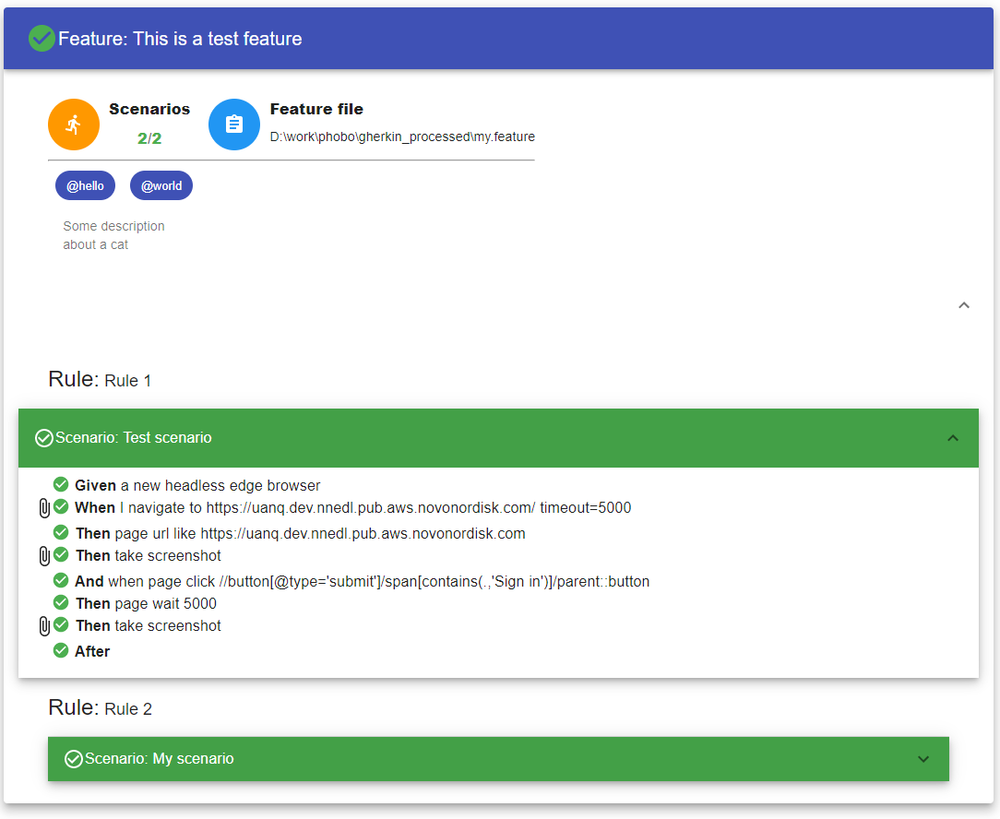

# Phobo

**Phobo** is a tool for running automated tests written in plain language. By writing tests in a natural language it is much easier to read and understand.
It will help improve collaboration on the test and make it much easier to communicate the test to other people.

Phobo is a standalone executable that can be run from the command line and it will generate a HTML report of the executed tests.

# Documentation

- [Install](#install)
- [Application usage](#application-usage)
    - [CLI](docs/cli.md)
    - [Configuration file](docs/config.md)
    - [Actions references](docs/actions.md)
        - [Browser actions](docs/browser_actions.md)
        - [AWS actions](docs/actions.md#aws-actions)
        - [JMESPATH actions](docs/jmespath_actions.md)
        - [Request actions](docs/request_actions.md)
        - [Intrinsic expression](docs/intrinsic_expression.md)
    - [Plugins](docs/plugins.md)
        - [API reference](docs/plugin_api.md)
    - [Migoi - HTML report](docs/migoi.md)
    - [Translators](docs/translators.md)
    - [Tags](#tags)
    - [Debugging](#debugging)
    - [Rollback](#rollback)
    - [Gherkin language extension](#gherkin-language-extension)
        - [Continue](#continue)
        - [Not](#not)

---

# Install

Phobo is available as a standalone executable for the following platforms:

- Windows ([latest binary](https://github.com/DasAng/phobo-release/releases/latest/download/phobo.exe))
- Linux ([latest binary](https://github.com/DasAng/phobo-release/releases/latest/download/phobo))
- Mac ([latest binary](https://github.com/DasAng/phobo-release/releases/latest/download/phobo-macos))

# Application usage

To run Phobo open a commandline or terminal and type the following

*Windows*

```shell
phobo.exe <feature file>
```

Example:
```shell
phobo.exe test.feature
```

*Linux*

```shell
./phobo <feature file>
```

Example:
```shell
./phobo test.feature
```


Where *feature file* is the feature file you wish to run. The result will be a HTML file generated in subdirectory named *out*. The HTML will look something like the following:



For additional information about the various CLI options available take a look at

- [CLI](docs/cli.md)

# Tags

Tags are a way to attach context to a feature or scenario. Tags are just text values that can have any meaning for a feature or scenario.
To add tags to a scenario or feature you will use the Gherkin tag syntax like for example:

```gherkin
@mytag @anothertag
Feature: This is a test feature
    
    @tagforscenario @anothertag
    Scenario: Test scenario
        
```

The example above adds 2 tags for the feature as well as 2 other tags for the scenario. Tags always starts with a *@* followed by any text without spaces in it.

Phobo supports a few special tags that are reserved by Phobo. These tags will have an effect on the execution of the tests. These are:

- `@clearLocalStorage`: This tag can be added to any scenario. When a scenario has this tag it will automatically trigger a cleanup step that clears all local storage data for a browser page whenever the scenario has finished. It can be used to for example always clean up local storage after browsing a site.

- `@cleanupAwsResources`: This tag can be added to any scenario. When a scenario has this tag it will automatically trigger a cleanup step at the end of the scenario that deletes all AWS resources created by any actions in the scenario.

# Debugging

Phobo can be set to run in debug mode, which can be useful for inspecting variables and stepping through code. See [here](docs/debugging.md) for more information.

# Rollback

Certain actions can create resources for example AWS actions can create S3 buckets, cognito user pools, etc. and Phobo keeps track of all the actions that creates some form of persistent resources.
You might be interested in removing or cleaning up these resources once your feature file has finished executing and as such the rollback feature of Phobo can help you do exactly that.

Imagine you are writing a feature file that creates several AWS cognito user pools and users, but you either forgot to include actions to remove those userpools and users at the end of the test, or the test might be interrupted prematurely and never gets to the part that removes the resources.
Now Phobo will keep a log file for each scenario that is executed and writes an entry in the log for those actions that creates a resource. So even if Phobo terminates prematurely or is interrupted the logs are still there. Think of these logs as kind of a transaction logs.

You can then run Phobo with the flag `--rollback` or `--r` and specify the rollback log file you wish to use for the cleanup.

Example:

> phobo.exe --rollback logs/rollback_2021_11_03

# Gherkin language extension

Phobo extends the Gherkin language syntax by supporting additional steps keywords. The following keywords can be used with Phobo:

- Continue
- Not


### Continue

When using this step keyword it will instruct Phobo to ignore any excpetions that might occur from the action performed. The action will pass even if an exception occurred. For example you don't care about if an exception throws when you try to call an API that does not exists:

```gherkin
Scenario: Ignore exception
    Continue http get https://nonexeistingapi/api/
```

### Not

This keyword will instruct Phobo to fail the step if the performed action does not throw an exception. This can be thouhgt of as a reverse assertion and can be used to expect that an exception will be thrown. For example this scenario test that calling a non existing api should throw an exception, and the test should pass.

```gherkin
Scenario: Expect exception
    Not http get https://nonexeistingapi/api/
```