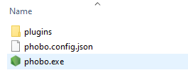
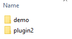

# CLI

Phobo is an executable that can be run from the command line. It can be used to run one or more **[Gherkin feature files](https://cucumber.io/docs/gherkin/reference/)**.

# Running specific features

- Specify a [glob](https://github.com/isaacs/node-glob) pattern

    ```shell
    phobo.exe data/**/*.feature
    ```
- Specify a feature directory

    ```shell
    phobo.exe data/mydir
    ```
- Specify a feature file

    ```shell
    phobo.exe my.feature
    ```

# Options

Phobo supports the following option flags:

- **--v, --version**: 
    
    This will display the application version

    ```shell
    phobo.exe --v
    phobo.exe --version
    ```

- **--c, --config \<config file>**: 
    
    Specify the configuration file that Phobo will use. The configuration file contains various settings that control how Phobo runs the automated tests.
    For a complete explanation of the configuration settings see the following reference [configuration file](config.md)

    ```shell
    phobo.exe --c phobo.config.json
    phobo.exe --config D:/mydir/phobo.config.json
    phobo.exe --c phobo.config.json my.feature
    ```

- **--g, --generate, --generate-force \<plugin name>**: 
    
    This option lets you generate a skeleton plugin template that can be used to develop plugins for Phobo. A plugin is a way to extend the functionality of Phobo.
    It is mainly used to add your own **gherkin When/Then/Given steps** that Phobo does not support out of the box. A plugin can then be written to match the new expressions and take appropriate actions.

    An example could be that you wish to add a new `When I sign in to mysite` expression, which will automatically perform logic to sign in to your specific website.

    All Phobo plugins must be placed inside the subdirectory *plugins*:

     

    Inside the *plugins* folder you will have a subdirectory for each plugin.

    Plugins are written in **Typescript**.

    For more information regarding plugins see [Plugins](plugins.md).

    If an existing plugin with the same name exists in the *plugins* directory then the plugin will not be generated. If you wish to force and overwrite any existing plugin then you can use the **--generate-force** flag instead.

    ```shell
    phobo.exe --g myplugin
    phobo.exe --generate-force myplugin
    ```

- **--d, --debug**:

    Set the log level to debug. This will enable more verbose output to the console.

    ```shell
    phobo.exe --d myfile.feature
    ```

- **--h, --help**:

    Displays the usage menu

    ```shell
    phobo.exe --h
    phobo.exe --help
    ```

- **--u, --update**:

    Check for new updates and if a newer version is found then update phobo to the latest version.

    ```shell
    phobo.exe --u
    phobo.exe --update
    ```

- **--validate \<feature>**:

    Validates the specified feature file for any errors or issues.

    ```shell
    phobo.exe --validate myfeature.feature
    ```

- **--json \<file>**:

    Specify the file path of the JSON report that will be generated

    ```shell
    phobo.exe myfeature.feature --json myreport.json
    ```