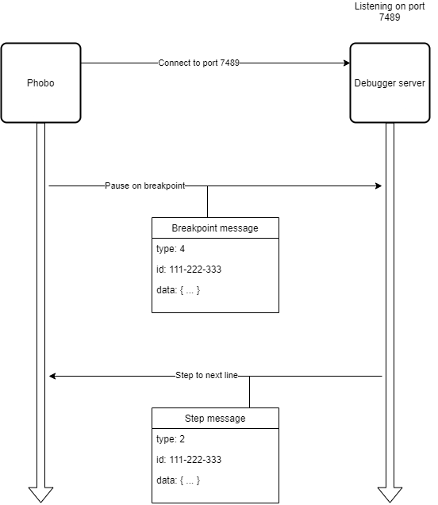

# Debugging

Phobo can be configured to run in debug mode which allows for setting breakpoints and inspecting variables. This can be useful for troubleshooting or inspecting the results of executing feature files.

So how does this debugging mode work?

Phobo can be configured to communicate with an external **debugger server**. This debugger server can be any program that runs a websocket server locally on a port number. Phobo will connect to the debugger server and exchange messages with the debugger server. See the following diagram.


To run Phobo in debug mode you must specify the following options flags `--attach-dbg`.

For example to run Phobo in debug mode and execute the feature file named *my.feature*:


*windows*:

> `phobo.exe --attach-dbg my.feature`

*linux*:

> `./phobo --attach-dbg my.feature`

Phobo will try and connect to the debugger server at the address and port specified in the Phobo configuration file, which defaults to:

```json
debugger: {
    address: "ws://localhost",
    port: 7489
}
```

If the debugger server is listening on another port you can change the port in the configuration file or you can overwrite the port in the configuration file by setting the option `--port`. For example you can overwrite the port and set it to 8080 like the following:

> `phobo.exe my.feature --attach-dbg --port 8080`

# Breakpoints

You can step through the actions or steps in Phobo during debugging by setting breakpoints. Breakpoints allow you to pause the code at the specified step or action in a feature file, so that you can inspect the variables or results of the executed steps or actions.

Phobo allows you to specify breakpoints by setting the line number in the feature file you wish to pause the execution. To do this you will pass the options `--b` or `--break` followed by the line number.

This example sets 2 breakpoints at line 10 and 20:

> `phobo.exe my.feature --attach-dbg --b 10 --b 20`

Whenever Phobo has executed the step or action at the specified location it will pause the execution and wait for the debugger server to response with a message indicating whether to continue the execution or go to the next step and pause again (that is called stepping through the code). In addition to pausing the code at the breakpoint location Phobo will also send information to the debugger server regarding the result of the executed step before the pause. The debugger server can use this information to inspect and display the information.

# Debugging protocol

The following will describe the debugging protocol used to exchange messages between Phobo and the debugger server.

All communication is done through websockets and the messages are JSON encoded.

When Phobo starts running it will initiate a connection to the debugger server before attempting to send and receive data to and from the debugger server. Once connected messages can be exchanged between Phobo and the debugger server.

## Message data

All messages are JSON encoded data structures with the following interface:

```js
interface DebuggerMessage {
    type: number,
    id: string,
    data: any
}
```

- `type`: A number identifying the type of the message. It can have one of the following values:
    - **0**: None. This is a message with no contextual meaning and is usually disregarded by Phobo.
    - **1**: Continue. This message can be sent to Phobo from a debugger server to tell Phobo to continue its execution after it has been paused by a breakpoint.
    - **2**: Step. This message can be sent to Phobo from a debugger server to tell Phobo to go to the next step and execute it and then pause again.
    - **3**: Stop. This message can be sent to Phobo from a debugger server to tell Phobo to stop its execution and terminate.
    - **4**: Breakpoint. This message is sent by Phobo to the debugger server that indicates phobo has paused execution due to a breakpoint.
    - **5**: Breakpoint changed. This message can be sent to Phobo from a debugger server to tell Phobo to update its breakpoints with the new changed breakpoints.

- `id`: A unique identifier for the message. A debugger server must always send a response to any message received by Phobo with the same id as the one received. For example a debugger server receives a message from Phobo indicating a breakpoint has been hit. Now the debugger server can send a response back telling Phobo to continue by setting the message type to **1** but setting the id to the same id received.
- `data`: Additional custom data related to the specific message type. For example for a message type of **4** (breakpoint) the data field will contain a list of line numbers indicating the new breakpoints for Phobo to set.

## Message flow

The flow of messages exchange between Phobo and debugger server can be simplified by the following illustration.



When Phobo is paused due to a breakpoint hit it will send a message of type **4** to the debugger server along with additional information inside the **data** field. The **id** field of the message will be set to a unique identifier which the debuggeer server must remember and keep somewhere. When the debugger server wants to let Phobo continue running it can either send a response message of type **2**(step) or **1**(continue) and set the **id** field to the same value that it received earlier by Phobo. This is used to ensure a correlation between the request from Phobo and the response from debugger server.

When Phobo receives a message from debugger server it will check which type of message it is and check the id value of the message to find the corresponding point in time it paused.

There exists several different message types that can be exchanged between Phobo and debugger server. The next section will go into details the various message types.

## Message types

Phobo supports the following message types

- [Breakpoint message](#breakpoint-message)
- [Step message](#step-message)
- [Continue message](#continue-message)
- [Breakpoint changed message](#breakpoint-changed-message)
- [Stop message](#stop-message)

### Breakpoint message

This message can be sent by Phobo to a debugger server. It will be sent when a breakpoint has been set and the execution hits the line where the breakpoint is set.

Phobo will pause and send this message to debugger server and wait for the debugger server to send a response back indicating what Phobo should do next.

The response message can either be a [step message](#step-message) or a [continue message](#continue-message).

The message looks like the following:

```json
{
    "type": 4,
    "id": "xxxx-xxxx-xxx",
    "data": {
        "line": 10,
        "column": 5,
        "status": 1,
        "message": "",
        "text": "this is a test step",
        "feature": "Test feature",
        "scenario": "Test scenario",
        "result": string|number|boolean|object|array,
        "attachments": [
            {
                "body": string,
                "mediatype": "application/json"
            }
        ]
    }
}
```

- `type`: This value is always set to 4.
- `id`: This field will be set to a unique identifier string
- `data`: This field is an object containing the following properties:
    - `line`: The line number of the breakpoint
    - `column`: The column number of the breakpoint
    - `status`: If the value is 1 then the action has been executed successfully otherwise the value will be 6 if it failed.
    - `message`: If an error occurred the reason will be in this field.
    - `feature`: The name of feature being executed
    - `scenario`: The name of the active scenario
    - `text`: The actual action text, eg. "I sign in to website"
    - `result`: This is the result of the executed action. The value can be a string, number, boolean, object or array.
    - `attachments`: This is an array of attachments for the executed action.
        - `body`: The value of the attached data
        - `mediatype`: The type of the attached data. Eg. "application/json", "text/plain" etc.


### Step message

This message can be sent by debugger server to Phobo in response to a [Breakpoint message](#breakpoint-message). This message is used to notify Phobo that it should continue running to the next step/action. It can be used to step through code one action/step at a time.

When debugger server sends this message it is important that the *id* field of the message corresponds to the same id of the breakpoint message sent by Phobo earlier.

The message looks like the following:

```json
{
    "type": 2,
    "id": "xxxx-xxxx-xxx",
    "data": null
}
```

- `type`: This value is always set to 2.
- `id`: This field should correspond to the same id sent by a breakpoint message from Phobo.
- `data`: No additional data

### Continue message

This message can be sent by debugger server to Phobo in response to a [Breakpoint message](#breakpoint-message). This message is used to notify Phobo that it should continue running to the next breakpoint if any or to the end.

When debugger server sends this message it is important that the *id* field of the message corresponds to the same id of the breakpoint message sent by Phobo earlier.

The message looks like the following:

```json
{
    "type": 1,
    "id": "xxxx-xxxx-xxx",
    "data": null
}
```

- `type`: This value is always set to 1.
- `id`: This field should correspond to the same id sent by a breakpoint message from Phobo.
- `data`: No additional data

### Breakpoint changed message

This message can be sent by debugger server to Phobo to update breakpoints. This can for example be used to add new breakpoints or remove existing breakpoints.

The message looks like the following:

```json
{
    "type": 5,
    "id": "xxxx-xxxx-xxx",
    "data": [10, 24, 5]
}
```

- `type`: This value is always set to 5.
- `id`: A unique identifier for this message
- `data`: A array containing the line numbers to set breakpoints.

### Stop message

This message is reserved for future use.

This message can be sent by debugger server to stop Phobo execution.

The message looks like the following:

```json
{
    "type": 3,
    "id": "xxxx-xxxx-xxx",
    "data": null
}
```

- `type`: This value is always set to 3.
- `id`: A unique identifier for this message
- `data`: Not used

# Debugger server

A debugger server can be written in any language as long as it uses websocket for the networking and follow the debugging protocol used by Phobo.

Here is a list of debugger server implementations:

|Name|Language|Description
--- | --- | ---
| [phobo-vscode](https://marketplace.visualstudio.com/items?itemName=dasang.phobo-vscode&ssr=false#overview) | Typescript | A visual studio code extension that allows debugging Phobo