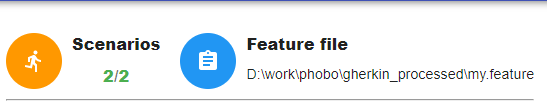
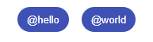
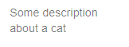
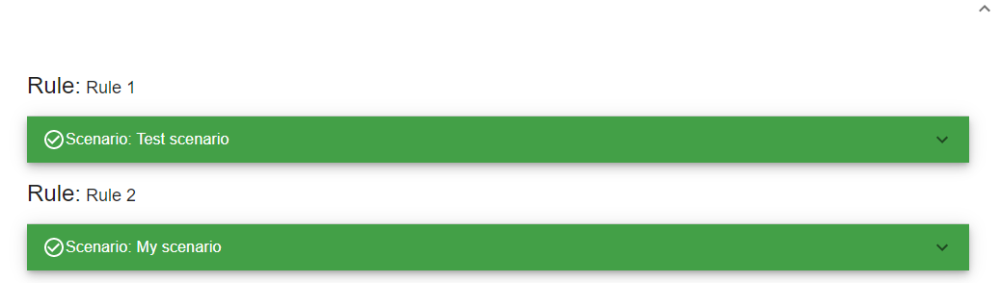
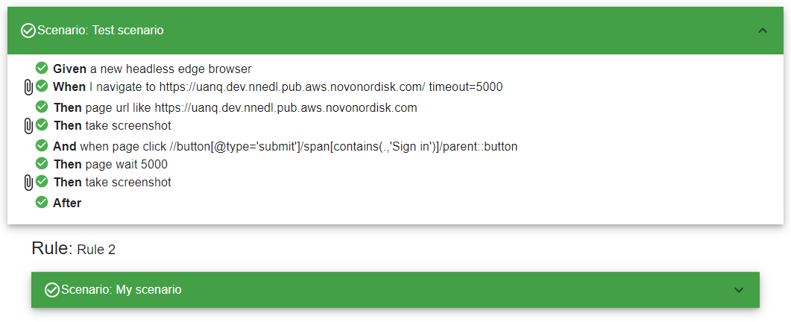
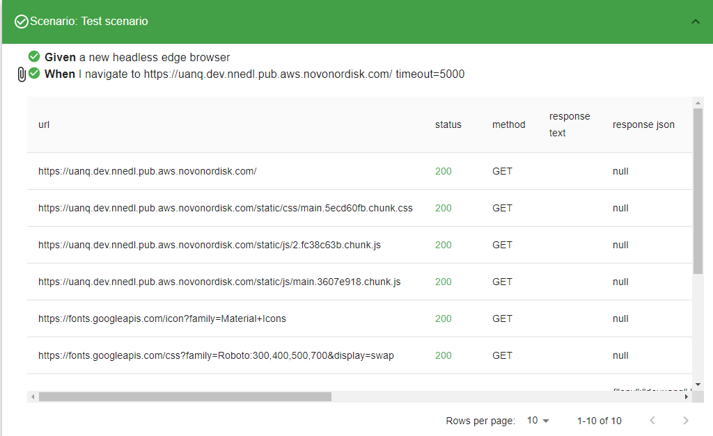
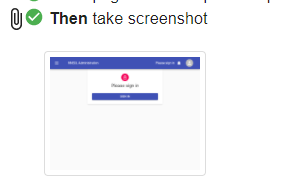
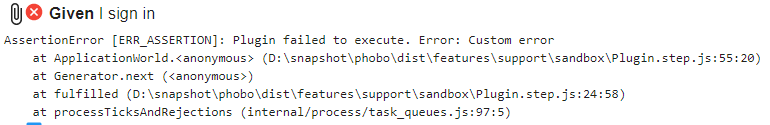

# Migoi

**Migoi** is the HTML report that Phobo generates as a result of running tests.

It is a single HTML file that displays the result of the tests. This section will presents the layout of the Migoi report.

# Overview

The report will display all the features files run by Phobo. Each feature will have scenarios that have been executed successfully or failed.

So looking at the image above we can see various information on the report. Let's break it down to see what is presented to us in the report.

# Layout structure

The number of successfull and failed scenarios will be shown like the image below:

As you can see from the above image we have ran 2 scenarios and all of them have passed. The green number indicates successfull scenarios. So it should be read as 2 sucessfull scenarios out of 2.

Next to that information is the actual name of the feature file that has been executed.

Next we have feature tags. If the feature does not have any tags these will not be shown:

As seen from above image we have 2 feature tags named **@hello** and **@world**. Feature tags is a way to add metadata that convey some meaning to a feature.

After the feature tags we have the feature description:

After the feature descripton we can expand the feature by clicking on the "expand more" icon to reveal all the scenarios for the feature:

Scenarios can be grouped under **Rules** which helps identify scenarios belonging together, but it is not mandatory to have rules.

Then comes the each scenario. Each scenario is presented as an accordion that can be expanded to reveal detailed information about the scenario. If a scenario has passed all its test then the scenario will be shown as green. If any of the steps failed in a scenario then the scenario will be shown as red. If the scenario could not be determined due to some undefined steps then the scenario will be shown as orange.

To reveal the detailed information for a given scenario click on the "expand more" icon next to the scenario. This will reveal all the steps thas has run for the scenario:

A scenario consists of a number of steps that describes what actions to take. A step can have one of the following status:

- Passed 
- Failed 
- Skipped 
- Undefined 

So from the above scenario all steps have passed. If a step has any additional information to show there will be an  icon next to the step. Click on the attachment icon will reveal additional data related to the step:

As can be seen from above image if a step produces network requests it will be displayed as a table containing the url, status, method and json response.
Steps can have all kinds of data attached, and these can range from images to json data. For example when taking a screenshot of a page an image will be attached to the step:

If you hover your mouse over the image it will be zoomed in larger so better can see the image.

If a step failed there will be an error message shown just below the step like the following:

