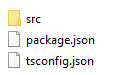
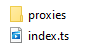

# Plugins

Phobo comes with a list of supported actions like browser automation and AWS api calls. But what if you want to perform an action that is not supported by Phobo out of the box?

Imagin that you have written a Gherkin feature file looking like this:

```gherkin
Feature: Test some custom logic

    Scenario: Execute my custom logic
        Then I send an email to john@someemail.com
```

Phobo does not have an action to execute the step `I send an email to john@someemail.com`. It does not know what to do with that step. So in order to actually send an email to someone you would need to somehow implement the sending of email code and let Phobo know how to use it.

The answer is to extend Phobo with custom actions by writing *Plugins*.

So plugins are a way to add your own custom code that performs whatever action you need. Phobo supports loading plugins from a directory and they will be able to execute the code written in the plugins.

Plugins are written in *Typescript* and must be transpiled to javascript before Phobo can load and execute them. To start developing plugins you can use the CLI option flag **--generate** to scaffold a new plugin.

For example to create a new plugin named "demo" you would use the following command:

*Windows*

```shell
phobo.exe --generate demo
```

*Linux*

```shell
./phobo --generate demo
```

A new folder named *demo* will automatically be created inside the *plugins* folder. The contents inside the *demo* folder will contain all the needed Typescript files in order to implement a plugin.

# Plugin architecture

Phobo runs all plugins as separate Node JS child processes. So when Phobo needs to execute a plugin it will spawn a new Node JS child process in which it communicates with the plugin through IPC channels.

In order for the plugins and Phobo to communicate the plugins must use a specific message protocol. The protocol is JSON based and it allows Phobo and plugins to exchange messages back and forth.

All the plugin Node JS processes will be terminated once Phobo exits. So they can only exists as long as Phobo is still running. Plugins are usually short lived and should perform its action within 1 minute.
The reason this is important is because Phobo will wait for plugin to finish executing within 1 minute before it times out and deems the action as having failed.

When Phobo needs to execute a plugin it will spawn a new Node JS process hosting the plugin code and it will send the action that it needs the plugin to perform. The plugin should then perform the action within the allowed timeout.
Once the plugin has performed the action it should exit and Phobo will resume other actions. If for some reason the plugin crashes or failed it should exit with code > 0 to allow Phobo to determine that the action has failed.

# Developing plugin

To start implementing a plugin you will need to let Phobo generate the needed templates. This can be done by using the **--generate** or **--generate-force** option in Phobo.

So to generate code for a new plugin named *demo* type the following:

*Windows*

```shell
phobo.exe --generate demo
```

*Linux*

```shell
./phobo --generate demo
```
A new folder named *demo* will automatically be created inside the *plugins* folder. The contents inside the *demo* folder will contain all the needed Typescript files in order to implement a plugin.

Inside the *demo* folder you will see the following files and folders:



This is a typical Typescript project with a *tsconfig.json* file that contains configuration for transpiling Typescript to javascript. The *package.json* contains the main configuration for the plugin. Lets take a closer look at the *package.json* file:

```json
{
    "name": "demo",
    "version": "1.0.0",
    "description": "",
    "main": "dist/index.js",
    "author": "",
    "license": "ISC",
    "gherkin": [
      "^demo plugin",
      "^demo navigate"
    ],
    "scripts": {
      "build": "tsc -p ./tsconfig.json"
    },
    "dependencies": {
      "uuid": "^8.3.2"
    }
}
```

The interesting part of the package.json file is the *gherkin* field. This field indicates a list of patterns using Regex to match Gherkin steps to be executed by the plugin. So the example above we have the following match patterns:

> `^demo plugin`

> `^demo navigate`

Those two Regex pattern will match sentences starting with the text:

- demo plugin
- demo navigate

So whenever Phobo encounters a Gherkin step that matches any of the plugin's match pattern it will execute the plugin and send it the text that matched. So for example if you have a Gherkin feature file like this:

```gherkin
Feature: Test some custom logic

    Scenario: Execute my custom logic
        Then demo plugin
```

Phobo will match the step `demo plugin` and figured out that it is your plugin that should handle the action. It will then spawn your plugin and send it the matched text `demo plugin`. Your plugin will from here on perform whatever task is needed and then exits.

So the *gherkin* fields in the package.json file specifies all the match patterns that your plugin supports.

Let's look inside the *src* folder:



Here you see a single file named *index.ts* and another folder named *proxies*. The *index.ts* file is your plugin's main entry file. It is this file that will get executed. Lets take a look at the file:

```js
import BasePlugin from "./proxies/BasePlugin";
class demo extends BasePlugin {
    
    protected execute(): Promise<unknown> {
        return this.match(/^demo plugin/i, async (match: any) => {
            console.log("Found match: ", match);
        })
        .then(() => {
            return this.match(/^demo navigate (.+)/i, async (match: any, url: string) => {
                console.log("Navigate to url: ", url);
                await this.page.navigateTo(url, 5000);
                console.log("done waiting for action");
            })
        })
    }
}

(async() => {
    await new demo().run();
})();
```

Looking at the code we see that there is a class named *demo* which extends another class named *BasePlugin*. All plugins must have a class that extends the *BasePlugin* class.

Then we instantiates an instance of the *demo* class and called the *run()* method on it:

```js
(async() => {
    await new demo().run();
})();
```

The important part of the *demo* class is the method *execute()* which must be implemented by all plugins that extends the *BasePlugin* class. The *exeute()* method is being called by the *run()* method and is where the actual logic of executing whatever action you need.

In the code above we can see that we used the method *match()* to do the actual matching of the text that the plugin receives. In this case we tried to match the regex pattern `^demo plugin` as well as the regex pattern `^demo navigate (.+)`. Does this sound familiar? Yes because these are exactly the match patterns that we have specified in our *package.json* file explained above.

So we can perform 2 different action in this plugin one that is associated with the pattern `^demo plugin` and one that is associated with the pattern `^demo navigate (.+)`.

So let's look at the first match pattern `^demo plugin`:

```js
this.match(/^demo plugin/i, async (match: any) => {
    console.log("Found match: ", match);
})
```

So if we found a match for the above pattern the action we perform will be to print out the text `Found match` to the console.

The second match pettern is `^demo navigate (.+)`:

```js
this.match(/^myplugin navigate (.+)/i, async (match: any, url: string) => {
    console.log("Navigate to url: ", url);
    await this.page.navigateTo(url, 5000);
    console.log("done waiting for action");
})
```

This match will do something more interesting. The action that will be performed is a call to:

```js
await this.page.navigateTo(url, 5000);
```

Which basically means we are trying to use the browser to navigate to the url specified in the match text.

Ok so you can see now that we can perform pattern matching and decide what actions to take using the method *match()* which a method of the *BasePlugin* class.

The match method has the following definition:

```js
protected async match(pattern: RegExp, fn: Function)
```

So the first parameter is the Regex pattern and the second parameter is a function to be executed when the pattern matches. The *fn* function has the following signature:

```js
function fn(...params)
```

So the function can take any number of parameters where the first parameter is always the full matched text. Any subsequent parameters will be passed based on the capturing groups in the regex pattern.

In the next section we will talk about how plugins communicate with Phobo using a messaging protocol. This is important if the plugin wishes to perform actions that Phobo exposes like the action to navigate to a url as we can see from the plugin code where we called `this.page.navigateTo`

# Save result

Your plugin can produce a result which can be any kind of data types like a string, number, array or json object. The result of executing your plugin will be saved as part of the step results. Phobo keeps internally a list of results from all steps and it can be used by intrinsic expressions like [<$steps$>](intrinsic_expression.md#<$steps.[index]$>) to access the result of any steps.

In order for your plugin to save this result you can store your result in the member variable [stepResult](plugin_api.md#member:-stepResult) of the [BasePlugin class](plugin_api.md#class-baseplugin).

Example in your plugin's *execute()* method you can store the result as follows:

```js
protected execute(): Promise<unknown> {

    return this.match(/^I add 2+2/i, async (match: any) => {
        const result = 2+2;
        this.stepResult = result;
    })
    
}
```

# Messaging protocol

Phobo and plugins communicate with each other through a messaging protocol based on JSON. This is used to exchange messages back and forth for example it can be from a plugin to inform Phobo to perform a specific action.

The message structure has the following signature:

```json
{
    "type": "string",
    "id": "string",
    "error": "string",
    "data": "any"
}
```

- **type**: This field indicates what type of action to perform either on Phobo or on the plugin. Phobo has a list of supported values which it understands and will perform the appropriate action depending on the value. For example `"type": "action_navigate_to_url"` will inform Phobo to use the browser to navigate to a specific url.
- **id**: This field is a unique GUID that identifies each message.
- **error**: This field is optional and if present will indicate any error message.
- **data**: This field contains custom data for the message and can be a JSON object or any other type.

Whenever a plugin sends a message to Phobo it expects a reply back from Phobo before it can continue. The reply from Phobo will have the field `"type": "acknowledge"`.

All the actions exposes by Phobo to plugins are wrapped inside classes and methods that hides the messaging exchange for you so that plugin developers who wish to ask Phobo to perform an action don't need to know about the messaging protocol implementation. All you need to do is call a method and it will automatically be executed by Phobo.

So for example for browser automation Phobo exposes a **ProxyPage** class which is instantiated by the **BasePlugin** class and you can access the proxy page object via the **page** member variable from your own plugin class. This proxy page object will have methods that you can use to for example to navigate to url or take screenshot etc.

For a complete list of all the api's exposed by Phobo to the plugins see [Plugin API reference](plugin_api.md)

# Compile plugin

Before Phobo can use the plugin you have developed you will need to compile or transpile the typescript code into javascript. To do that you can run the command:

```shell
npm run build
```

This will transpile the typescript codes into javascript and the output will be stored inside a *dist* folder.

So how does Phobo know which javascript file is the main entry file to execute when it loads the plugin? The answer lies in the package.json file.

The package.json file has a field named *main* which points to *dist/index.js* which is the javascript file that has been produced by transpiling the typescript code.
